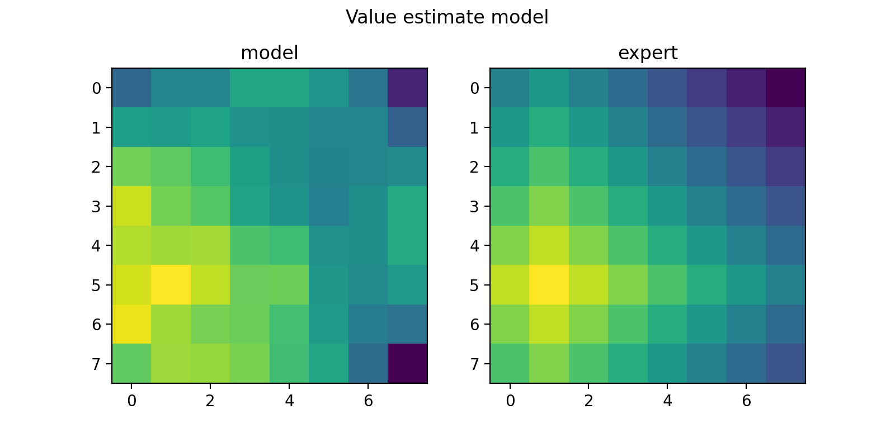
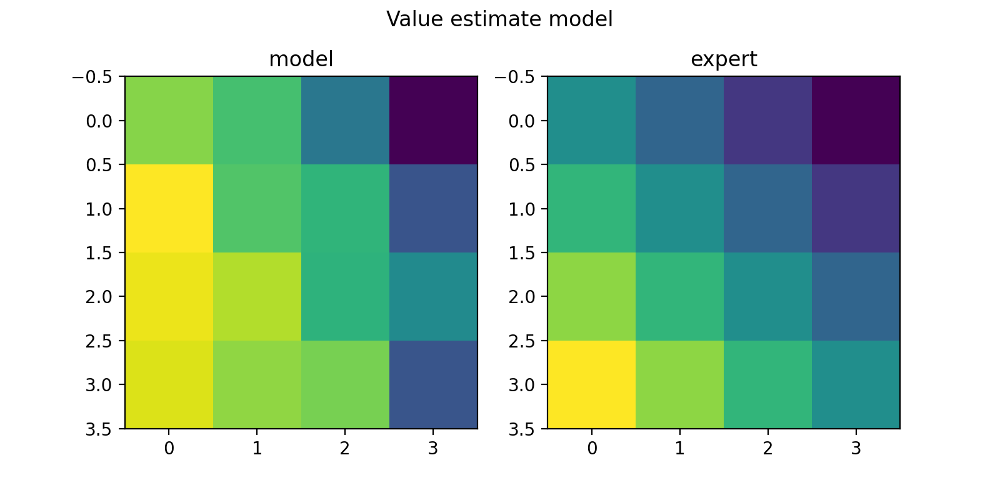
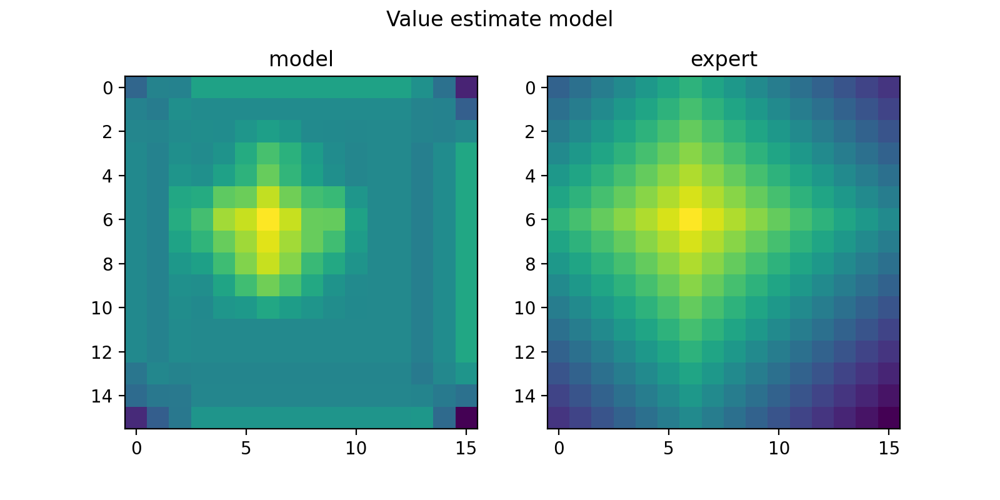

# Value Matrix 

1. To train a network that learns a value matrix for planning on 8x8 grid
```
python3 test_8x8.py
```
This creates `train_goals.npy` , `test_goals.npy` and saves the trained model at `model.pt`.

2. To evaluate the model, ensure `test_goals.npy` and  `model.pt` are present. Then run:
```
python3 eval_model.py
```
You can see the expert's path matrix and model's prediction for different locations of goals. These goal location were not seen during training (check the difference in `train_goals.npy` and `test_goals.npy`)


3. To evaluate the model's generalization to other maps, check `eval_4x4.py` and `eval_16x16.py`.
You can see that the model suffers from long range values in case of 16x16 grid.
The model was almost correct for 4x4 grid, implying that it will be easier to generalize to smaller maps after training to plan on larger maps. 




### TODO:

* Test in cluttered environments 

* Try with partial observability (gym_minigrid.wrappers.HumanFOVWrapper)

* Fine tune the model with RL.